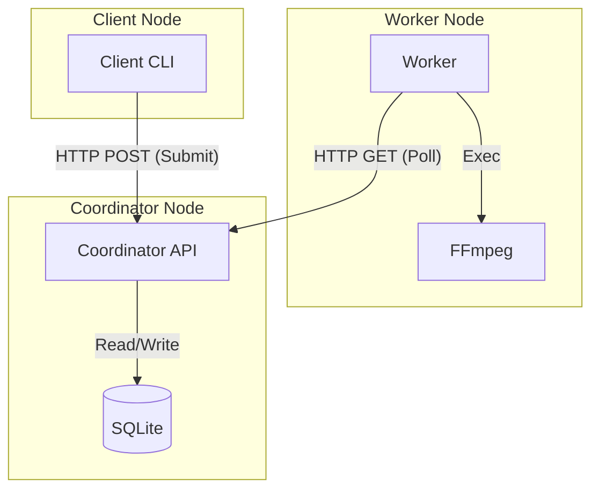
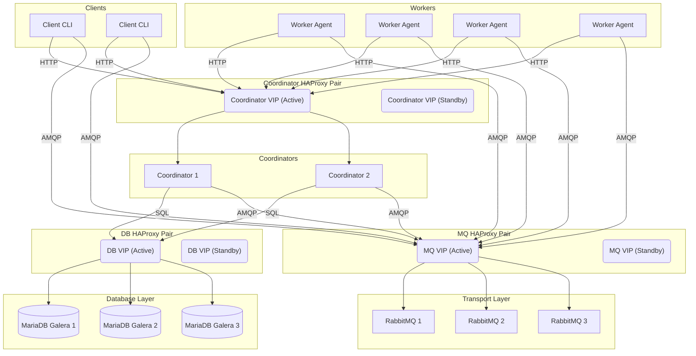
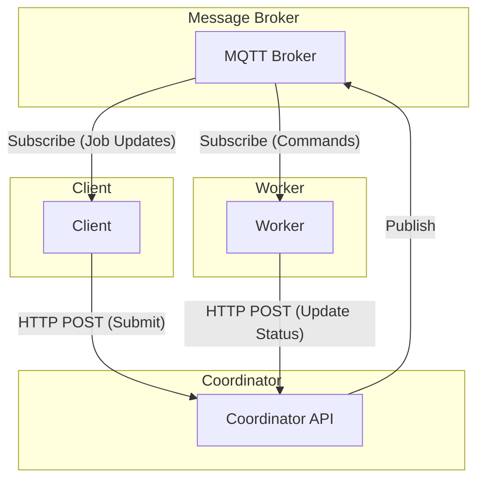
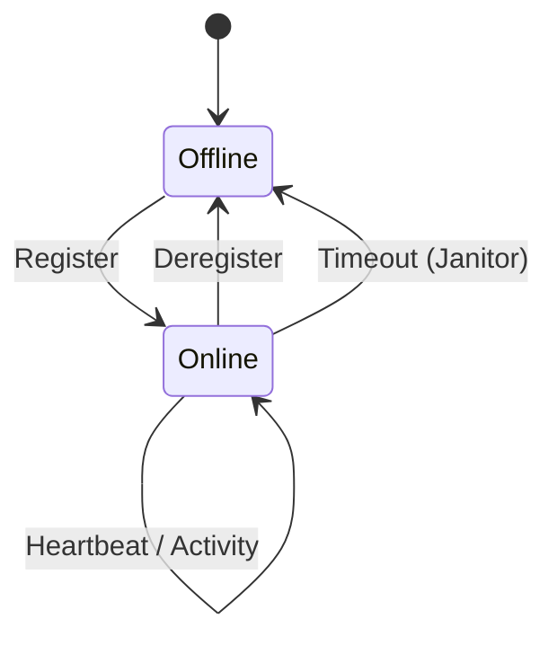
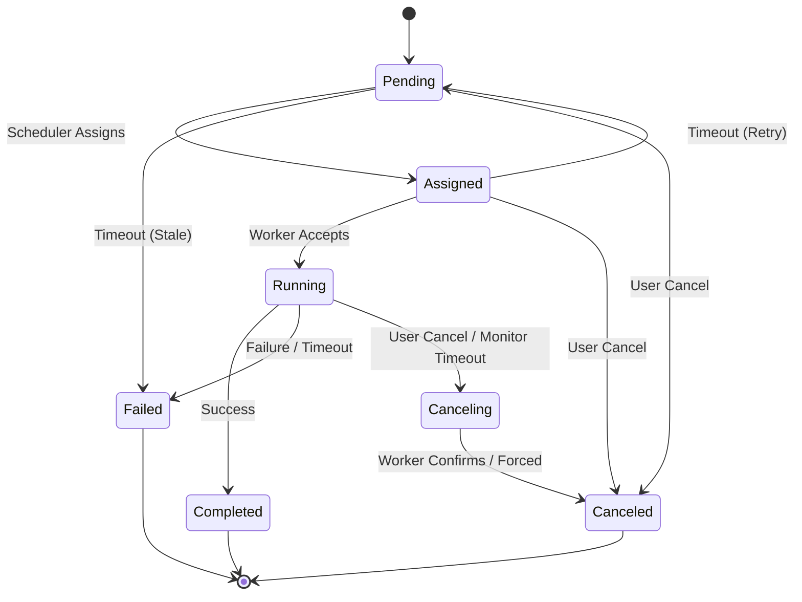

# Architecture

This document describes the design and components of the DFFmpeg distributed system.

## High-Level Overview

DFFmpeg is designed to coordinate distributed FFmpeg encoding jobs. It separates the **job submission** (Client), **job management** (Coordinator), and **job execution** (Worker).

### Key Concepts

*   **Coordinator-Centric**: The Coordinator is the single source of truth for job state.
*   **Pull-Based Execution**: Workers poll the Coordinator for jobs (or receive notifications to poll).
*   **Path-Blind**: The Coordinator stores logical paths (using variables), allowing clients and workers to have different mount points.
*   **Stateless Protocol**: Communication is primarily stateless HTTP, authenticated via HMAC.

## Scenarios

### 1. Simple Architecture (Development / Small Scale)
This is the default configuration and is ideal for development, testing, or small single-server deployments.

*   **Database**: SQLite (local file).
*   **Transport**: HTTP Polling (no external broker required).

### 2. High Availability (HA) Reference Architecture
This setup represents a proven production-grade environment, designed for resilience and horizontal scalability.

*   **Load Balancing**: Redundant HAProxy pairs (Active/Passive via Keepalived) providing Virtual IPs (VIPs) for each service tier.
*   **Message Broker**: 3x RabbitMQ hosts (Clustered) behind an HAProxy VIP.
*   **Database**: 3x MariaDB/Galera Cluster hosts behind an HAProxy VIP.
*   **Coordinator**: 2x `dffmpeg-coordinator` instances (Active/Active) behind an HAProxy VIP.
*   **Transport**: RabbitMQ (AMQP) for low latency and durability.

### 3. Real-Time Updates with MQTT
MQTT is ideal for lightweight status updates to clients and workers, especially in IoT-like networks.

*   **Transport**: MQTT.
*   **Note**: HTTP is still used for all "Uplink" communication (submitting jobs, updating status). MQTT is "Downlink" only (notifications).

## Component Details

### Coordinator
*   **API**: FastAPI application serving the REST API.
*   **Scheduler**: Determines which job goes to which worker based on capabilities (future) and load.
*   **Janitor**: Background task that cleans up stale jobs and workers (e.g., if a worker crashes and stops sending heartbeats).

### Worker
*   **Executor**: Runs the actual FFmpeg process. Captures stdout/stderr and streams it back to the Coordinator.
*   **Mount Manager**: Verifies that required paths are mounted before accepting work.

### Client
*   **Submission**: Parses local paths, converts them to variables, and submits the job.
*   **Monitor**: Polls (or listens via MQTT/AMQP) for job status and logs.

## State Diagrams

### Worker Lifecycle

### Job Lifecycle

