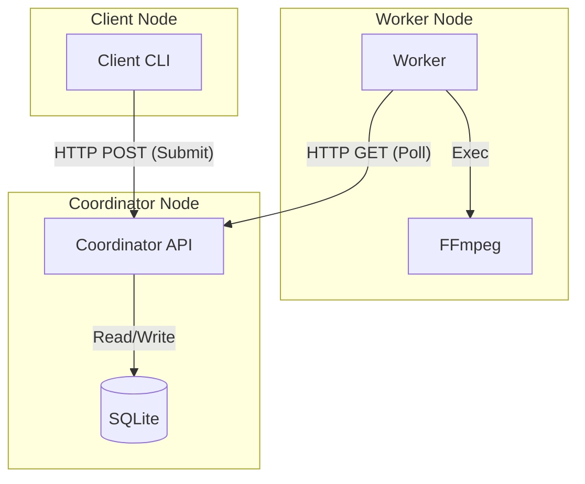
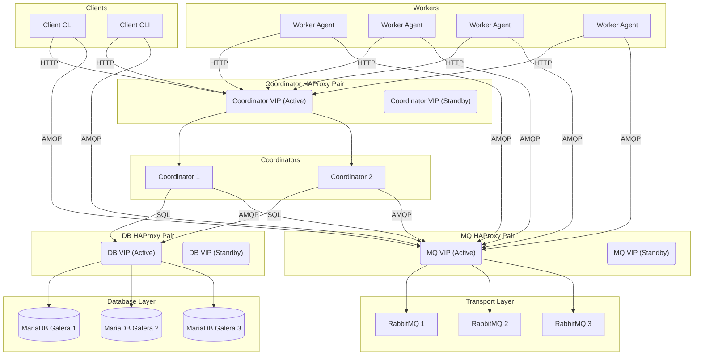
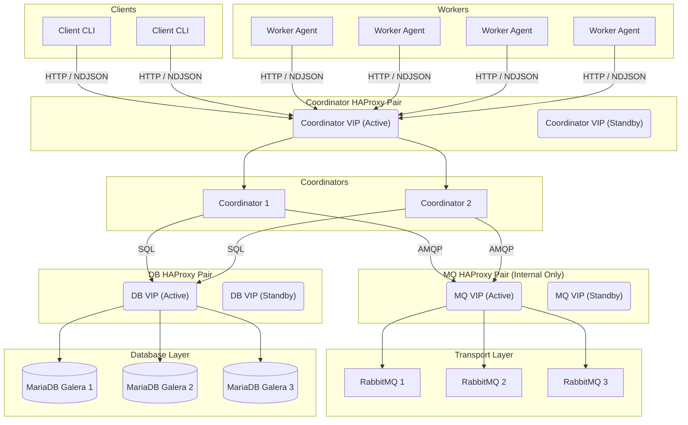
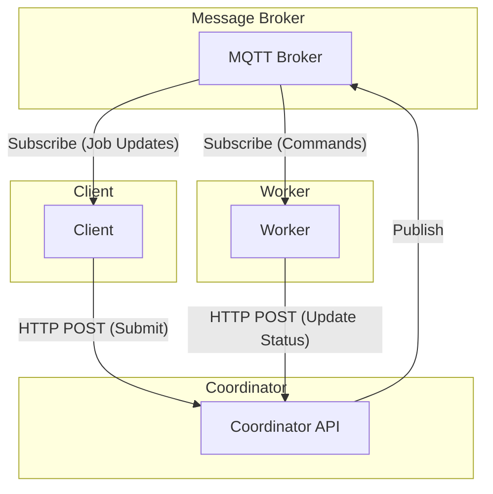
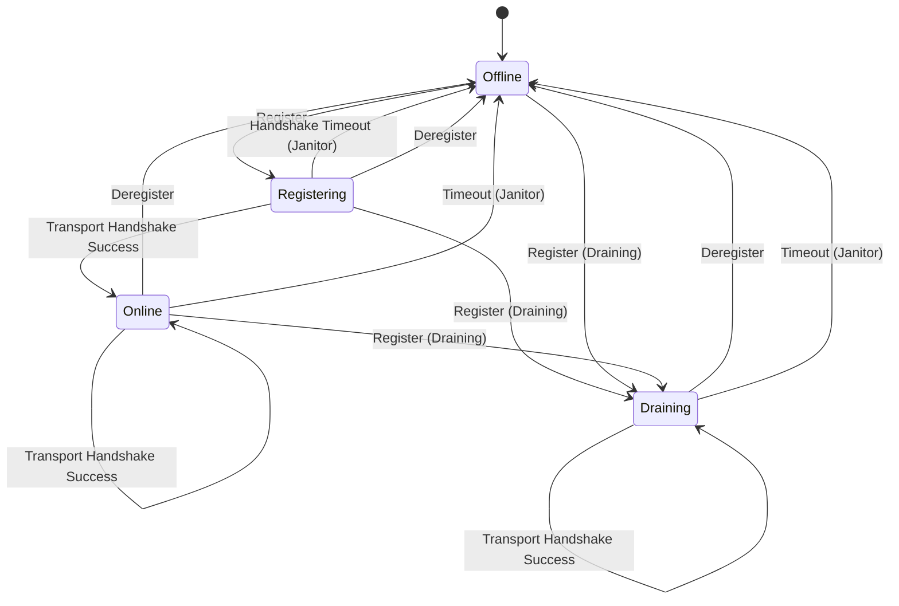
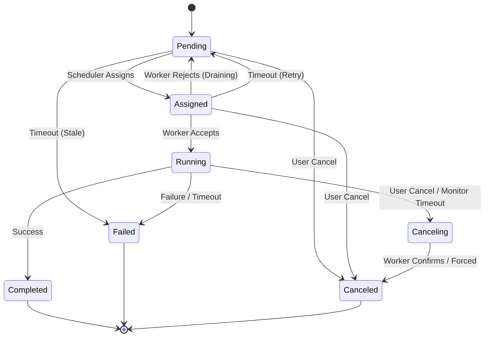

# Architecture

This document describes the design and components of the DFFmpeg distributed system.

## High-Level Overview

DFFmpeg is designed to coordinate distributed FFmpeg encoding jobs. It separates the **job submission** (Client), **job management** (Coordinator), and **job execution** (Worker).

### Key Concepts

*   **Coordinator-Centric**: The Coordinator is the single source of truth for job state.
*   **Pull-Based Execution**: Workers poll the Coordinator for jobs (or receive notifications to poll).
*   **Path-Blind**: The Coordinator stores logical paths (using variables), allowing clients and workers to have different mount points. This includes the job's working directory.
*   **Stateless Protocol**: Communication is primarily stateless HTTP, authenticated via HMAC.

## Scenarios

### 1. Simple Architecture (Development / Small Scale)
This is the default configuration and is ideal for development, testing, or small single-server deployments.

*   **Database**: SQLite (local file).
*   **Transport**: HTTP Polling (no external broker required).


```mermaid
graph TD
    subgraph "Worker Node"
        W[Worker]
        FF[FFmpeg]
    end

    subgraph "Client Node"
        C[Client CLI]
    end

    subgraph "Coordinator Node"
        Coord[Coordinator API]
        DB[(SQLite)]
    end

    C -- HTTP POST (Submit) --> Coord
    W -- HTTP GET (Poll) --> Coord
    Coord -- Read/Write --> DB
    W -- Exec --> FF
```

### 2. High Availability (HA) Reference Architecture
This setup represents a proven production-grade environment, designed for resilience and horizontal scalability.

*   **Load Balancing**: Redundant HAProxy pairs (Active/Passive via Keepalived) providing Virtual IPs (VIPs) for each service tier.
*   **Message Broker**: 3x RabbitMQ hosts (Clustered) behind an HAProxy VIP.
*   **Database**: 3x MariaDB/Galera Cluster hosts behind an HAProxy VIP.
*   **Coordinator**: 2x `dffmpeg-coordinator` instances (Active/Active) behind an HAProxy VIP.
*   **Transport**: RabbitMQ (AMQP) for low latency and durability.


```mermaid
graph TD
    subgraph "Clients"
        Client1[Client CLI]
        Client2[Client CLI]
    end

    subgraph "Workers"
        Worker1[Worker Agent]
        Worker2[Worker Agent]
        Worker3[Worker Agent]
        Worker4[Worker Agent]
    end

    subgraph "Coordinator HAProxy Pair"
        APP_VIP("Coordinator VIP (Active)")
        APP_VIP_stby("Coordinator VIP (Standby)")
    end
    subgraph "MQ HAProxy Pair"
        MQ_VIP("MQ VIP (Active)")
        MQ_VIP_stby("MQ VIP (Standby)")
    end
    subgraph "DB HAProxy Pair"
        DB_VIP("DB VIP (Active)")
        DB_VIP_stby("DB VIP (Standby)")
    end

    subgraph "Coordinators"
        C1[Coordinator 1]
        C2[Coordinator 2]
    end

    subgraph "Transport Layer"
        MQ1[RabbitMQ 1]
        MQ2[RabbitMQ 2]
        MQ3[RabbitMQ 3]
    end

    subgraph "Database Layer"
        DB1[(MariaDB Galera 1)]
        DB2[(MariaDB Galera 2)]
        DB3[(MariaDB Galera 3)]
    end

    %% External Traffic
    Client1 & Client2 & Worker1 & Worker2 & Worker3 & Worker4 -- HTTP --> APP_VIP
    APP_VIP --> C1 & C2

    Client1 & Client2 & Worker1 & Worker2 & Worker3 & Worker4 -- AMQP --> MQ_VIP
    MQ_VIP --> MQ1 & MQ2 & MQ3

    %% Internal Traffic
    C1 & C2 -- SQL --> DB_VIP
    DB_VIP --> DB1 & DB2 & DB3

    C1 & C2 -- AMQP --> MQ_VIP
```

### 2b. High Availability (HA) with Message Bus-Backed HTTP Polling/Streaming
This setup is a variation of the HA Reference Architecture where the Clients and Workers do **not** have direct network access to the message broker (e.g. RabbitMQ) and instead use HTTP Long Polling or HTTP Streaming (NDJSON). The Coordinator proxies all message subscription and polling operations to the underlying broker.

*   **Load Balancing**: Redundant HAProxy pairs (Active/Passive via Keepalived) providing Virtual IPs (VIPs) for the Coordinator and Database tiers. Note that the Message Broker VIP (`MQ_VIP`) is only accessible internally by the Coordinator instances.
*   **Message Broker**: 3x RabbitMQ hosts (Clustered) behind an HAProxy VIP, accessed strictly by the Coordinators.
*   **Database**: 3x MariaDB/Galera Cluster hosts behind an HAProxy VIP.
*   **Coordinator**: 2x `dffmpeg-coordinator` instances (Active/Active) behind an HAProxy VIP.
*   **Transport**: HTTP Polling/Streaming on the client/worker side, proxied to RabbitMQ/MQTT by the Coordinator backend.


```mermaid
graph TD
    subgraph "Clients"
        Client1[Client CLI]
        Client2[Client CLI]
    end

    subgraph "Workers"
        Worker1[Worker Agent]
        Worker2[Worker Agent]
        Worker3[Worker Agent]
        Worker4[Worker Agent]
    end

    subgraph "Coordinator HAProxy Pair"
        APP_VIP("Coordinator VIP (Active)")
        APP_VIP_stby("Coordinator VIP (Standby)")
    end
    subgraph "MQ HAProxy Pair (Internal Only)"
        MQ_VIP("MQ VIP (Active)")
        MQ_VIP_stby("MQ VIP (Standby)")
    end
    subgraph "DB HAProxy Pair"
        DB_VIP("DB VIP (Active)")
        DB_VIP_stby("DB VIP (Standby)")
    end

    subgraph "Coordinators"
        C1[Coordinator 1]
        C2[Coordinator 2]
    end

    subgraph "Transport Layer"
        MQ1[RabbitMQ 1]
        MQ2[RabbitMQ 2]
        MQ3[RabbitMQ 3]
    end

    subgraph "Database Layer"
        DB1[(MariaDB Galera 1)]
        DB2[(MariaDB Galera 2)]
        DB3[(MariaDB Galera 3)]
    end

    %% External Traffic (HTTP Only!)
    Client1 & Client2 & Worker1 & Worker2 & Worker3 & Worker4 -- HTTP / NDJSON --> APP_VIP
    APP_VIP --> C1 & C2

    %% Internal Traffic
    C1 & C2 -- SQL --> DB_VIP
    DB_VIP --> DB1 & DB2 & DB3

    C1 & C2 -- AMQP --> MQ_VIP
    MQ_VIP --> MQ1 & MQ2 & MQ3
```

### 3. Real-Time Updates with MQTT
MQTT is ideal for lightweight status updates to clients and workers, especially in IoT-like networks.

*   **Transport**: MQTT.
*   **Note**: HTTP is still used for all "Uplink" communication (submitting jobs, updating status). MQTT is "Downlink" only (notifications).


```mermaid
graph TD
    subgraph "Message Broker"
        MQTT[MQTT Broker]
    end

    subgraph "Coordinator"
        Coord[Coordinator API]
    end

    subgraph "Worker"
        W[Worker]
    end

    subgraph "Client"
        C[Client]
    end

    %% Uplink (HTTP)
    C -- HTTP POST (Submit) --> Coord
    W -- HTTP POST (Update Status) --> Coord

    %% Downlink (MQTT)
    Coord -- Publish --> MQTT
    MQTT -- Subscribe (Job Updates) --> C
    MQTT -- Subscribe (Commands) --> W
```

## Component Details

### Coordinator
*   **API**: FastAPI application serving the REST API.
*   **Scheduler**: Determines which job goes to which worker based on capabilities (future) and load.
*   **Janitor**: Background task that cleans up stale jobs and workers (e.g., if a worker crashes and stops sending heartbeats).

### Worker
*   **Executor**: Runs the actual FFmpeg process. Captures stdout/stderr and streams it back to the Coordinator.
*   **Mount Manager**: Verifies that required paths are mounted before accepting work.

### Client
*   **Submission**: Parses local paths (including the current working directory), converts them to variables, and submits the job.
*   **Monitor**: Polls (or listens via MQTT/AMQP) for job status and logs.

## State Diagrams

### Worker Lifecycle


```mermaid
stateDiagram-v2
    [*] --> Offline
    Offline --> Registering: Register
    Registering --> Online: Transport Handshake Success
    Registering --> Offline: Handshake Timeout (Janitor)
    Registering --> Offline: Deregister
    Registering --> Draining: Register (Draining)
    Offline --> Draining: Register (Draining)
    Online --> Draining: Register (Draining)
    Online --> Offline: Deregister
    Online --> Offline: Timeout (Janitor)
    Online --> Online: Transport Handshake Success
    Draining --> Offline: Deregister
    Draining --> Offline: Timeout (Janitor)
    Draining --> Draining: Transport Handshake Success
```

## Standard-Stream Data Plane (Binary Stdout Streaming)

To support high-throughput, byte-transparent streaming for commands that output binary streams (such as raw video frames or muxed transport streams via stdout), DFFmpeg separates concerns into two distinct communication paths:

1.  **Control Plane (REST & Transports)**: Carries all job metadata, status updates, heartbeats, and control signaling (including the `JobStreamModeSwitchMessage` notification).
2.  **Data Plane (Fast Filesystem & Stream Storage Engine)**: Handles the high-speed transfer of raw binary byte segments from the Worker to the Coordinator, and then from the Coordinator down to the Client.

### Stream Lifecycle & Heuristics

```
+---------------------------------------------------------------------------------+
|                                    WORKER                                       |
|                                                                                 |
|  [stdout] ──> Chunk Line Buffer ──> (Text Mode: utf-8) ──> JobLogsMessage (DB)  |
|                      │                                                          |
|                      ├── [Null or Non-UTF-8 Byte Detected]                      |
|                      ▼                                                          |
|             (One-Way Binary Latch) ──> Flush Pending Text Logs                  |
|                      │                                                          |
|                      └── [Stream Chunk Uploads] ───────────────────────────┐    |
|                                                                            │    |
+----------------------------------------------------------------------------│----+
                                                                             │
                                                                             ▼
+---------------------------------------------------------------------------------+
|                         COORDINATOR CLUSTER (Active/Active)                     |
|                                                                                 |
|  Upload: POST /jobs/{id}/streams/stdout/chunks?seq=N <─────────────────────┘    |
|  Download: GET /jobs/{id}/streams/stdout                                        |
|                                                                                 |
|  Streams Shared Storage Base Directory: {streams_storage_root}/                 |
|  - Write atomic rename buffers (.part -> .chunk) to prevent partial reads       |
|  - Sliding-Window Pruning (unlinks processed chunk files based on bytes_read)    |
|  - Explicit Stream ACK: POST /ack (instantly purges stream chunk folders)       |
+---------------------------------------------------------------------------------+
                                                                             │
                                                                             ▼
+---------------------------------------------------------------------------------+
|                                    CLIENT                                       |
|                                                                                 |
|  1. Receives standard text logs until JobStreamModeSwitchMessage arrives.       |
|  2. Synchronously flushes sys.stdout and connects to GET /streams/stdout.      |
|  3. Pipes raw binary chunks unconditionally to sys.stdout.buffer (and flushes). |
|  4. Heartbeats cumulative total_bytes_read to trigger server-side pruning.      |
|  5. Sends final completion ACK stream command upon successful EOF.              |
+---------------------------------------------------------------------------------+
```

#### A. Worker-Side Adaptive Latching & Sync Flushes
*   The Worker subprocess utilizes the unified, shared **`StdioHandler`** class (located in `dffmpeg-common`'s `stdio_stream_handler.py`) to manage both standard output and standard error streams.
*   This grants **both stdout and stderr** native, high-resolution line ending extraction (extracting CRLF, LF, and CR delimiters cleanly) with split-packet trail boundary buffering and >64KB line segment chunking.
*   For `stdout`, `StdioHandler` is initialized with a binary callback. It decodes bytes as text in 4KB chunks until a null byte (`\x00`) or non-UTF-8 boundary is encountered, at which point it instantly latches permanently to **Binary Mode**.
*   **Log Flush Synchronization**: To guarantee byte-perfect sequence and prevent initial text headers (like y4m or mpegts headers) from showing up out of order at the end of the client's file, the Worker instantly and synchronously flushes its entire log queue (`_flush_logs()`) to the Coordinator's database *before* starting the binary uploader task.
*   The Worker then streams subsequent chunks directly to the Coordinator via HTTP POST.

#### B. Clustered High Availability (HA) Filesystem Requirements
*   The Coordinator Stream Storage Engine stores uploaded chunks on disk under `{streams_storage_root}/{job_id}/{stream_name}/`.
*   To prevent reading incomplete chunks in Active/Active Coordinator setups, the Coordinator writes uploads to `.part` files and atomically renames them to `.chunk` upon completion.
*   **Important HA Requirement**: In multi-node, Active/Active deployments behind load balancers (such as HAProxy VIP pools), **the `streams_storage_root` must point to a shared network filesystem (such as CephFS, NFS, or GlusterFS)**. This ensures that any Coordinator instance can seamlessly receive worker chunks and concurrently serve tail-streaming downloads to clients without connection affinity.

#### C. Real-Time Heartbeat Pruning & Immediate ACK Deletion
*   **Sliding-Window Pruning**: During active downloads, the Client reports its cumulative stream consumption progress (`total_bytes_read`) inside its periodic heartbeats. The Coordinator fast-stats and unlinks (deletes) processed chunk files on the fly, keeping disk footprint near zero during multi-gigabyte video encodes.
*   **Explicit Stream ACK**: Upon successfully reading the EOF marker, the Client issues a final `POST /jobs/{job_id}/streams/{stream_name}/ack` command to the Coordinator, which instantly purges the entire job's stream directory on disk. This avoids relying on the 60-minute Janitor grace sweep delay and keeps filesystems pristine.

### Job Lifecycle


```mermaid
stateDiagram-v2
    [*] --> Pending

    Pending --> Assigned: Scheduler Assigns
    Pending --> Failed: Timeout (Stale)
    Pending --> Canceled: User Cancel

    Assigned --> Running: Worker Accepts
    Assigned --> Pending: Worker Rejects (Draining)
    Assigned --> Pending: Timeout (Retry)
    Assigned --> Canceled: User Cancel

    Running --> Completed: Success
    Running --> Failed: Failure / Timeout
    Running --> Canceling: User Cancel / Monitor Timeout

    Canceling --> Canceled: Worker Confirms / Forced

    Completed --> [*]
    Failed --> [*]
    Canceled --> [*]
```
